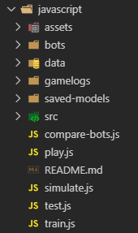
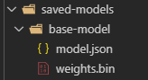
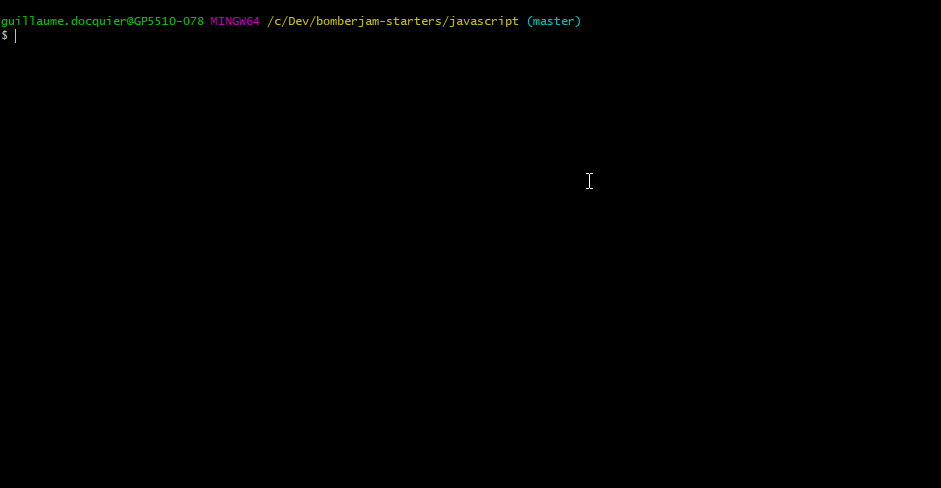
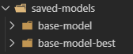
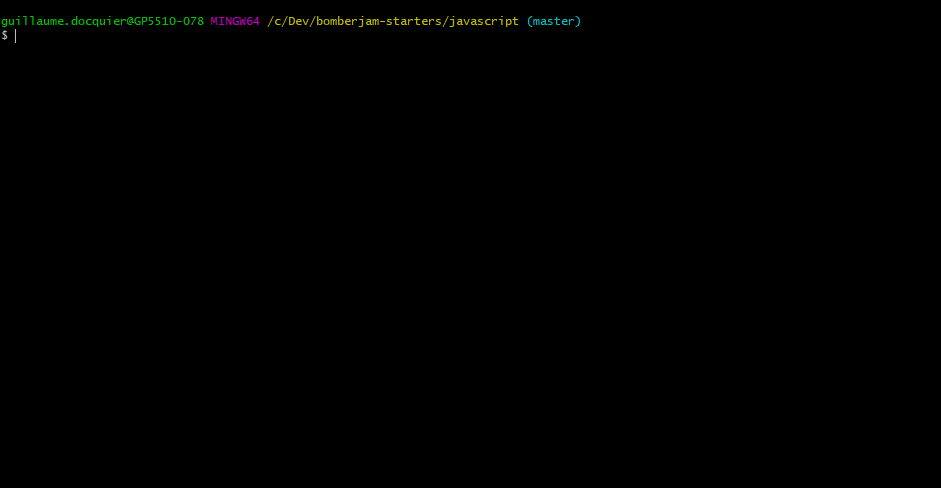
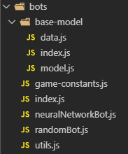

# Bomberjam JavaScript Starter  
Welcome to the Bomberjam JavaScript Starter! In here you will find useful information about how to get started with training your bot, debugging its performance and seeing it play!  

If at any point you have questions, don't hesitate to poke me! (Guillaume Docquier)

## Setup
You do not need Python to run this starter. If you have errors that seem related to python, ignore them.  
You will need to install NodeJS v12 and npm
- If you already have node installed, check the version with ``node -v``
- If it's not 12.x, you need to update  

You can download NodeJS, which comes with npm, from their [official website](https://nodejs.org/en/) or install it through [chocolatey](https://chocolatey.org/packages/nodejs).  
``choco install nodejs``

Once all of this is done, run ``npm install``  
Also, download the dataset we will provide you and extract it in ``data/``. It might take some time.  

You can test that your installation worked by running ``node train.js``.  
You should see a bunch of numbers and a progress bar.  
- Sometimes, tensorflow doesn't install properly. You'll get errors when trying to import it.  
- To fix this, you can run ``npm run fix-tf-install-unix`` or ``npm run fix-tf-install-windows``, depending on the type of terminal you are using (do you use ``ls`` or ``dir`` ?).  

## Project Structure  
At the root level, you will find the following files and folders:  

  

### data/
Contains the training dataset, you need to extract the files there.  

### gamelogs/
Contains the games replay files. Simulations you run will be saved here so you can look at them afterwards.  
To watch your gamelogs, you need to start the server by using ``npm run server``.  
The url for the Bomberjam UI will be displayed. Once in there, you can use the replay feature to import a gamelog file.  

### saved-models/
Contains the save files for your neural networks after training.  

  
The other scripts will use your model name to find the corresponding model in here.

### src/
Code used by the starter to make your life easier. You do not need to edit this to succeed, but if you want to, you can do it.  

### train.js
Use this to train your bot on the dataset. The provided data consists of 6,000 games generated by a very good bot.  
Each file contains an ordered list of game states and actions taken by each bot at that state.  
It will use the game state as input, and the actions as labels.  

  

Because each game contains 4 players, each game tick is in fact 4 sets of inputs and labels.  
This allows you to train your bot to play as any player.  
The starter abstracts the "labels" part for you. Your responsibility will be to convert the game state to an actual input for your neural network.  

The script will run through all the files by batches. It will fit your model on each batch, save your model, and fit on the next batch.  
It is VERY long to train through all the files. You do not need to train through all the files and that is why the model is saved after each batch.  
Note that the script will also save your best model based on the validation accuracy as ``MODEL_NAME-best``. You can try and see if it's really better.  

  

Note that depending on your models and the specified batch size, training might exceed Node's RAM limits.  
The error when that happens looks like:  
- ``FATAL ERROR: Ineffective mark-compacts near heap limit Allocation failed - JavaScript heap out of memory``  

However, you can increase this limit, like so:  
- ``node --max-old-space-size=4096 train.js``  

The script also supports an argument to specify how many games to load in memory at once:  
``node train.js 50`` (defaults to 50, increase with caution)  

### test.js
Use this to debug your neural network. It will output statistics about the predictions of your bot.  
The script supports an argument to specify how many games to test against:  
``node test.js 25`` (defaults to 25)  

  

The results will be saved with your model in a json file.

### simulate.js
Use this when you want to play multiple games quickly with the same bot. You will see some useful stats about the games.  
The script supports an argument to specify how many games to test against:  
``node simulate.js 10`` (defaults to 10)  

  

The results will be saved with your model in a json file.

### compare-bots.js
Use this when you want to pit your models against each other. This will help you determine which one performs best.  
The script supports an argument to specify how many games to play in each starting position:  
``node compare-bots.js 10`` (defaults to 10)  

### play.js
Use this when you want to play a live game.  
You will need to edit ``config.json`` for the server IP, the room ID and your player name.  

### bots/
This is where you'll code. We provide you with an example of bot configuration that you need to improve.  

  

All the utility scripts provided to you will revolve around the export in ``bots/index.js``.  
It exports the bot you want to use, which consists of 4 properties:  
- ``newBot``: Function that creates a new instance of your bot class when playing / simulating.  
- ``modelName``: String used when saving / loading your model.  
- ``buildModel``: Function that creates your Tensorflow neural network when training / testing.  
- ``gameStateToModelInputConverter``: Function that takes a game state and a player id and returns the data to be fed into you neural network.  

It is recommended to keep your models as you go in order to compare them.  
To do so, create multiple folders inside ``bots/`` with your bot definitions.  
Give them different names, then in ``bots/index.js``, simply export the bot you want to use.  
You can export ``botsToCompare``. This is will be used by ``compare-bots.js``. Fill this with 4 (different) bots.  

In a bot folder, you should find 3 files:  
- ``index.js``: In here, you export the properties stated above from your other files.  
- ``data.js``: In here, you export ``gameStateToModelInputConverter`` and a ``DATA_SHAPE`` that you will need in ``model.js``.  
- ``model.js``: In here, you export ``buildModel`` and a ``modelName``. It will contain the definition of your neural network.  

Note that you can organize the code how you want it. The only important part are the expected exports stated earlier.  

## Prop tips
- You can expect results after 20-30 minutes of training. If you do not start to see a good behaviour after that much training, do not try to train it longer. Focus on changing your your input data or your network.  
- You are multiple people in your team, use your CPUs wisely!  
- Look at your games! It is not because you have high accuracy or score that your bot performs well.  
- Use the scripts. I won't tell you how to use them, but I can tell you they are very useful.  
- Plug your laptops, you'll need the juice.  